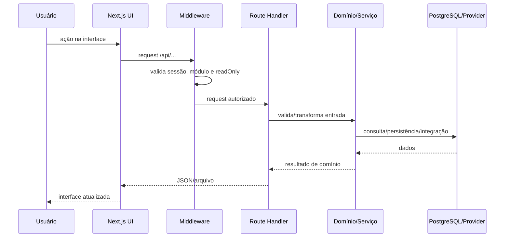

# 01 · Arquitetura

## 1. Estilo arquitetural

A aplicação é um **monólito modular** em Next.js. O termo “monólito” aqui descreve o deploy e o repositório únicos; “modular” descreve a separação por domínios de negócio.

Não existe uma fronteira física entre “FE” e “BE” em repositórios separados. A fronteira lógica é:

```text
app/**/page.js + app/components/**
           │
           │ fetch / navegação
           ▼
app/api/**/route.js
           │
           ├──────────────► lib/**          serviços/regras
           ├──────────────► app/lib/**      domínio legado/compartilhado
           ├──────────────► data/**         parsers, mapeamentos, modelos
           │
           ▼
PostgreSQL / Vercel Blob / providers externos
```

## 2. Fluxo de uma requisição



## 3. Fluxo de dados de scouting

O fluxo de Ligas evita misturar fornecedores cedo demais.

```text
Export SportsBase ─► parser SportsBase ─► dataset fonte SportsBase ─┐
                                                                  │
                                                                  ├─► identidade/fusão ─► ficha canônica
                                                                  │
Export Wyscout   ─► parser Wyscout   ─► dataset fonte Wyscout   ──┘
                                                                         │
                                                                         ▼
                                                               rankings / filtros / scouting
```

Arquivos-chave:

- `data/sportsbase-map.js`
- `data/wyscout-seried.js`
- `data/provider-data-fusion.js`
- `app/lib/playerMaster.js`
- `app/api/ligas-v2/[slug]/sportsbase/route.js`
- `app/api/ligas-v2/[slug]/wyscout/route.js`

### Identidade

`buildPlayerIdentity()` em `app/lib/playerMaster.js` cria uma chave de identidade usando nome normalizado e, quando disponível, data/ano de nascimento. Nacionalidade e posição são usados como fallback. O objetivo é evitar `JOIN` ingênuo apenas por nome.

A tabela `cig_player_sources` preserva a relação entre a ficha canônica e cada ocorrência/fonte.


## 3.1 Identidade do próprio clube

A identidade do clube não deve ficar espalhada em comparações de string. `lib/club-config.js` é a fonte canônica para nome, código, aliases e helpers de identificação. Isso reduz acoplamento e facilita manutenção consistente da identidade do Confiança.

Os contratos internos do próprio clube usam nomenclatura canônica `club*`.

## 4. Camadas

### 4.1 Interface

- `app/**/page.js`
- `app/components/**`

Responsabilidades:

- interação e visualização;
- estado de tela;
- filtros;
- chamadas à API;
- exportações client-side quando apropriado.

Não deve conter secret nem acesso direto a banco.

### 4.2 API interna

- `app/api/**/route.js`

Responsabilidades:

- validar request;
- verificar parâmetros;
- chamar serviços/parsers;
- persistir/consultar;
- retornar contratos HTTP.

### 4.3 Domínio e serviços

- `lib/**`
- `app/lib/**`

Responsabilidades:

- regras analíticas;
- schemas e persistência compartilhada;
- geração de relatórios;
- automações;
- identidade de atletas;
- lógica que não deve depender da UI.

### 4.4 Adaptadores e dados

- `data/**`
- `lib/providers/**`

Responsabilidades:

- mapear colunas de fornecedores;
- transformar formatos externos em formato interno;
- fazer matching/fusão;
- isolar contratos de APIs públicas/terceiras.

## 5. Persistência

O banco principal é PostgreSQL. A aplicação utiliza majoritariamente `@vercel/postgres`; alguns componentes históricos usam o driver Neon diretamente. A padronização desse acesso está registrada como dívida técnica.

No estado atual, vários domínios executam `CREATE TABLE IF NOT EXISTS`/`ALTER TABLE ... ADD COLUMN IF NOT EXISTS` em runtime. Isso foi útil para evolução rápida e deploy sem etapa de migration, mas a arquitetura alvo de produto comercial deve usar migrations versionadas.

## 6. Arquivos

Vercel Blob é usado em fluxos que precisam manter arquivos persistentes. Uploads destinados apenas a parsing podem ser processados em memória e persistidos como estruturas no PostgreSQL.

## 7. Autenticação

`middleware.js` é a fronteira de autorização global:

1. ignora rotas públicas/assets;
2. exige `NEXTAUTH_SECRET`;
3. carrega token NextAuth;
4. determina módulo necessário;
5. valida `modules` do usuário;
6. bloqueia escrita de perfis `readOnly`.

A autenticação atual atende ao ambiente interno controlado. Caso a gestão de usuários cresça, vale migrar contas fixas de environment variables para persistência/IdP com administração de usuários e recuperação de acesso.

## 8. Crons

`vercel.json` registra:

- `/api/scouting-automation/cron` — rotina diária;
- `/api/notificacoes` — rotina semanal.

Rotas de cron exigem `CRON_SECRET`.

## 9. Prioridades técnicas de evolução

Antes de considerar mudanças arquiteturais maiores, as prioridades recomendadas são:

1. migrations versionadas;
2. camada consistente de acesso ao banco;
3. jobs assíncronos para processamentos longos;
4. observabilidade;
5. testes automatizados;
6. profiling de gargalos reais;
7. separar serviços somente quando houver motivo operacional mensurado.
